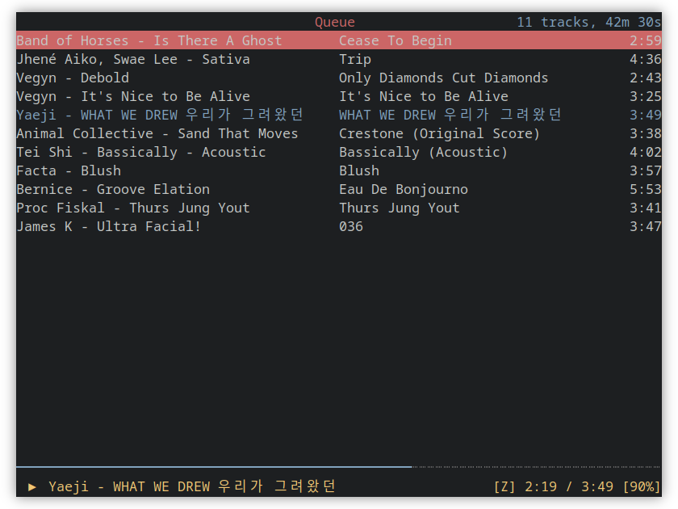

  <picture>
    <source media="(prefers-color-scheme: dark)" srcset="images/logo_text_dark.svg">
    <source media="(prefers-color-scheme: light)" srcset="images/logo_text_light.svg">
    
  </picture>
  <h3>An ncurses Spotify client written in Rust using librespot</h3>

  

ncspot is an ncurses Spotify client written in Rust using librespot. It is heavily inspired by
ncurses MPD clients, such as [ncmpc](https://musicpd.org/clients/ncmpc/). My motivation was to
provide a simple and resource friendly alternative to the official client as well as to support
platforms that currently don't have a Spotify client, such as the \*BSDs.

ncspot only works with a Spotify premium account as it offers features that are not available for
free accounts.

## Features
- Support for tracks, albums, playlists, genres, searching...
- Small [resource footprint](doc/resource_footprint.md)
- Support for a lot of platforms
- Vim keybindings out of the box
- IPC socket for remote control
- Automatic authentication using a password manager

## Installation
ncspot is available on macOS (Homebrew), Windows (Scoop), Linux (native package and Flathub) and the
BSD's. Detailed installation instructions for each platform can be found [here](/doc/users.md).

## Configuration
A configuration file can be provided at `$XDG_CONFIG_HOME/ncspot/config.toml`. Detailed
configuration information can be found [here](/doc/users.md#configuration).

## Building
Building ncspot requires a working [Rust installation](https://www.rust-lang.org/tools/install) and
a Python 3 installation. To compile ncspot, run `cargo build`. For detailed instructions on building
ncspot, there is more information [here](/doc/developers.md).

## Packaging
Information about provided files, how to generate some of them and current package status accross
platforms can be found [here](/doc/package_maintainers.md).
